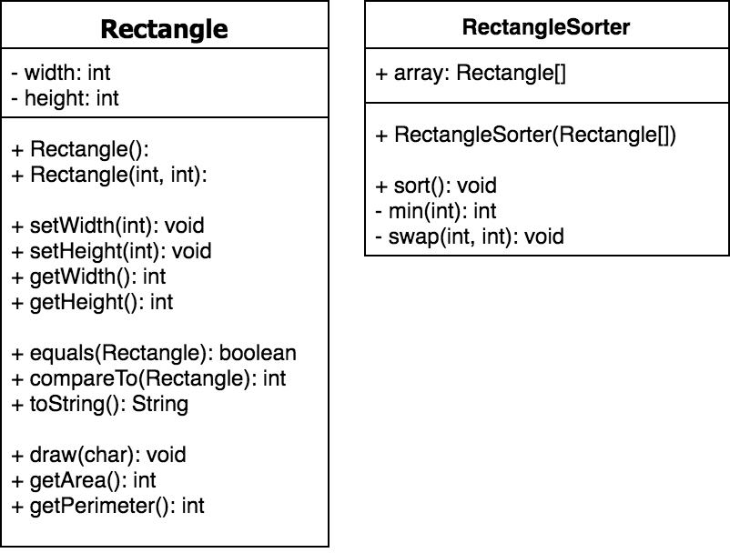

After cloning the repository run the following commands to get the latest test cases.
``` sh
git submodule init
git submodule update --remote
```

Implement the classes shown in the uml diagram below. Before writing any code run the classes ```RectangleTest``` and ```RectangleSorterTest``` and make sure the unit tests at least compile.
As you code run the test cases to ensure your changes are effective. Remember to commit and push changes to your repository. Run the class ```TestRunner``` to estimate your grade.



<div style="page-break-after: always;"></div>

#### Rectangle
The rectangle class should have integer attributes for width and height. It should have one default constructor and another which accepts values for both members. There should be standard accessors and mutators. The following code shows how the most of the methods should work.

``` java
Rectangle r1 = new Rectangle(3, 4);
r1.getWidth(); // 3
r1.draw('*');
System.out.println();
r1.getArea(); // 12
r1.getPerimter(); // 14

Rectangle r2 = new Rectangle(1, 5);
r2.draw();

r1.toString(); // {type: Rectangle, width: 3, height: 4}
r1.equals(r2); // false

// comparison based on difference in area
r1.compareTo(r2); // 7

Rectangle r3 = new Rectangle(1, 5);
r2.compareTo(r3); // 0
r2.equals(r3); // true
r2 == r3; // false
```
```
***
***
***
***

-----
```

<div style="page-break-after: always;"></div>

#### RectangleSorter
The rectangle sorter class should be contructed with an array of rectangles. The class should have methods to sort the rectangles with selection sort. The sorting should be based on the retangle areas with the smallest rectangle having index zero.

``` java
Rectangle[] arr = new Rectangle[3];
arr[0] = new Rectangle(4, 5);
arr[1] = new Rectangle(1, 2);
arr[2] = new Rectangle(3, 2);

RectangleSorter sorter = new RectangleSorter(arr);
sorter.sort();

for(Rectangle item: arr)
    System.out.println(item);
```
```
{type: Rectangle, width: 1, height: 2}
{type: Rectangle, width: 3, height: 2}
{type: Rectangle, width: 4, height: 5}
```
